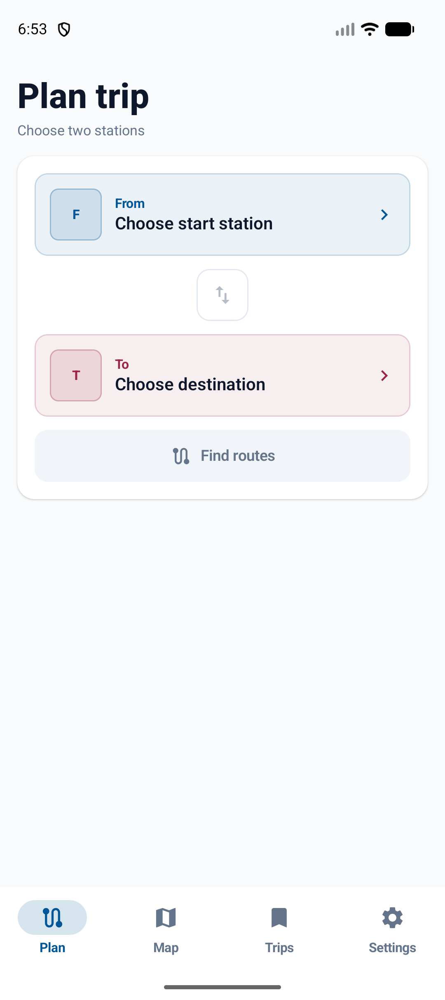
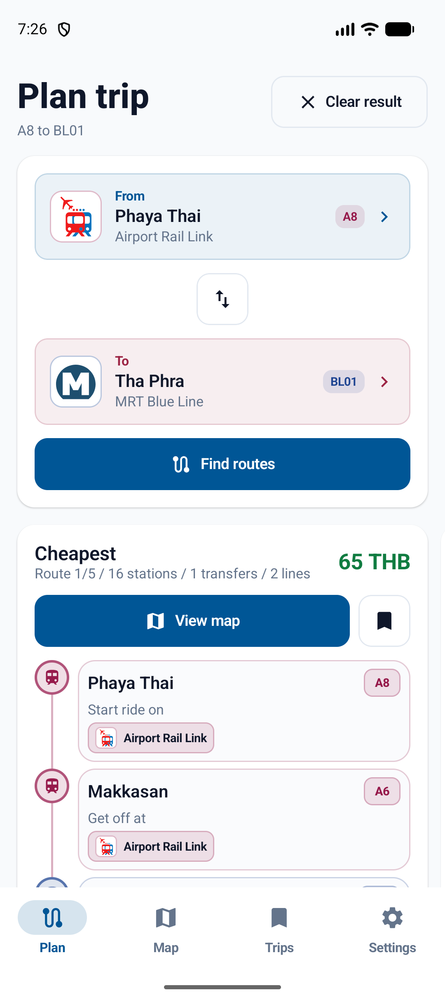
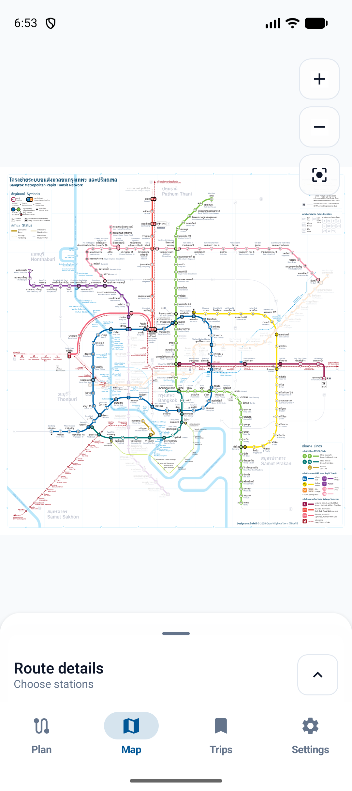
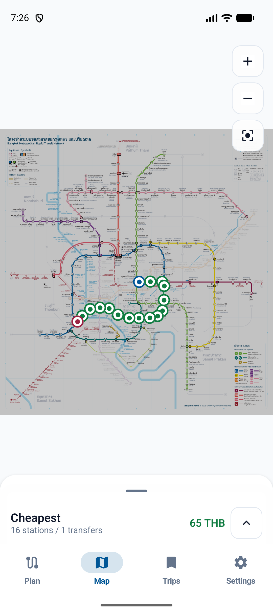
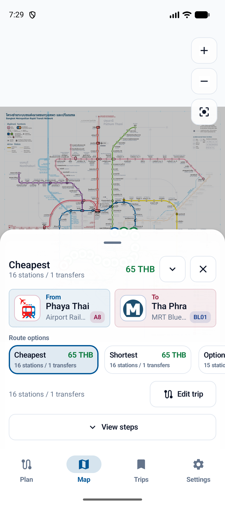
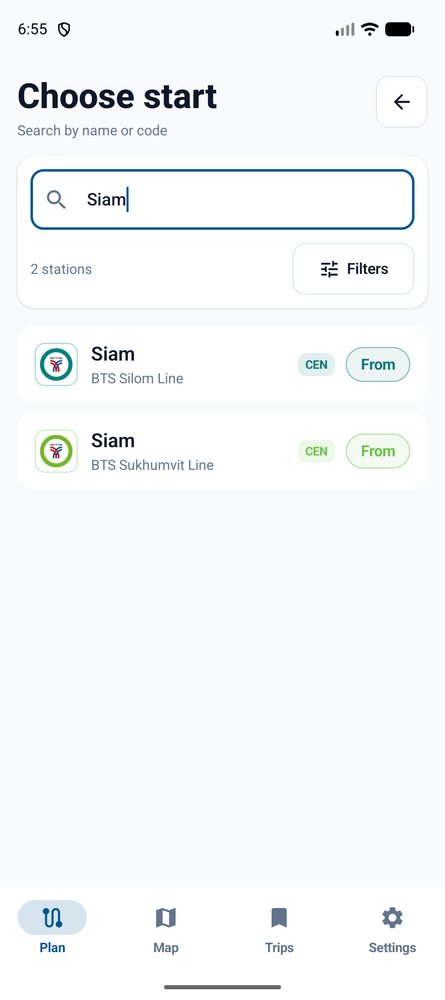
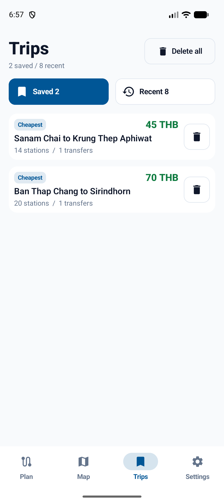
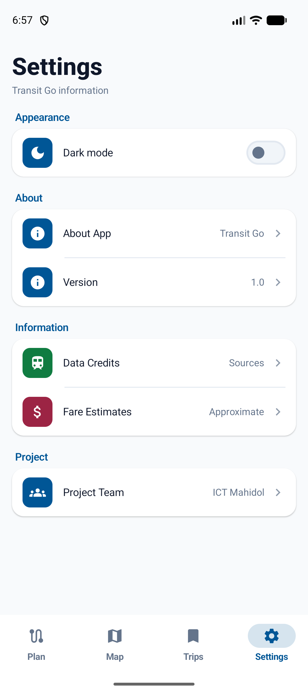

# Transit Go

Transit Go is an Android app for exploring Bangkok's urban rail network and planning station-to-station journeys. Search stations by name or code, compare route options, and follow a selected journey on a pannable, zoomable rail map.

## Screen previews

<p align="center">
  
  
  
  
</p>
<p align="center">
  
  
  
  
</p>

## What you can do

- Search Bangkok rail stations by station name, code, or line, with nearby-station discovery when location is available.
- Plan a trip and compare available routes, including shortest and cheapest options.
- Explore the network map with pan and zoom gestures, route overlays, station details, and a draggable route-options sheet.
- Save routes and revisit recent trips.
- Switch between light and dark appearance; the network map artwork remains in its original colors.
- View rail-line logos and approximate fare information.

## Build and run

Open the project in Android Studio, let Gradle sync, and run the `app` configuration on an emulator or Android device. Or build a debug APK from the project root:

```bash
./gradlew :app:assembleDebug
```

The app requires Android 7.0 (API 24) or newer. Station, place, and route data are loaded from the [Bangkok Railway API](https://bangkok-railway-api.onrender.com); an internet connection is needed for those live data features.

## Tech stack

Kotlin · Jetpack Compose · Material 3 · Retrofit/OkHttp · Koin
